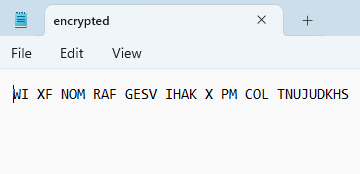
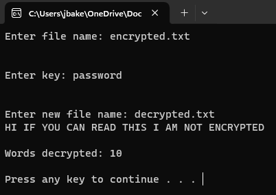

# C++ Encryption
I completed this project was attending Liberty University Online. This project encrypts a .txt file using the Vigenere Cypher. Although simple, it displays a basic understanding of encryption and how you go about implemenenting it in code.

<h1> Images </h1>

